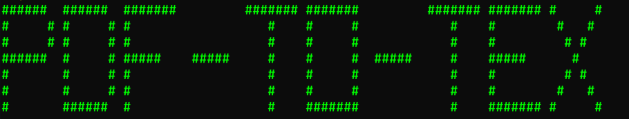

<div align="center">
<a href="#">
    
  </a>
<p align="center">
    <a
      href="https://github.com/Shirshakhtml/pdf-to-text/issues/new?assignees=&labels=bug">Report
      Bug</a>
    ·
    <a href="https://github.com/Shirshakhtml/pdf-to-text/issues">Request Feature</a>
  </p>

  
  
  
   <br />  <br />

</div>

# Description

*The program makes use of the `PyPDF2` library, which is a third-party library that provides functionality to read, manipulate, and extract information from PDF files. First, the library is imported. Next, the program opens the PDF file. The program then loops through all the pages in the PDF file. The program then closes the PDF file.*

## Requirements

- **PyDF2:** ```pip install PyDF2```
